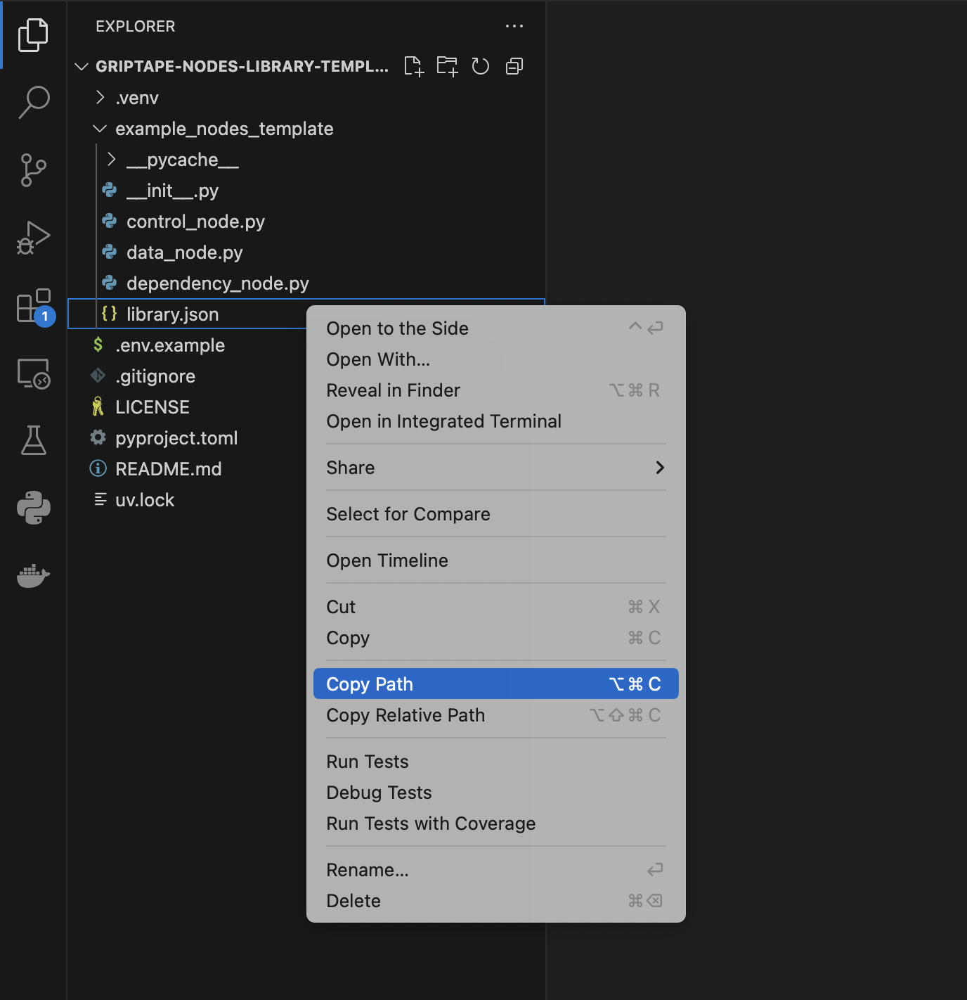
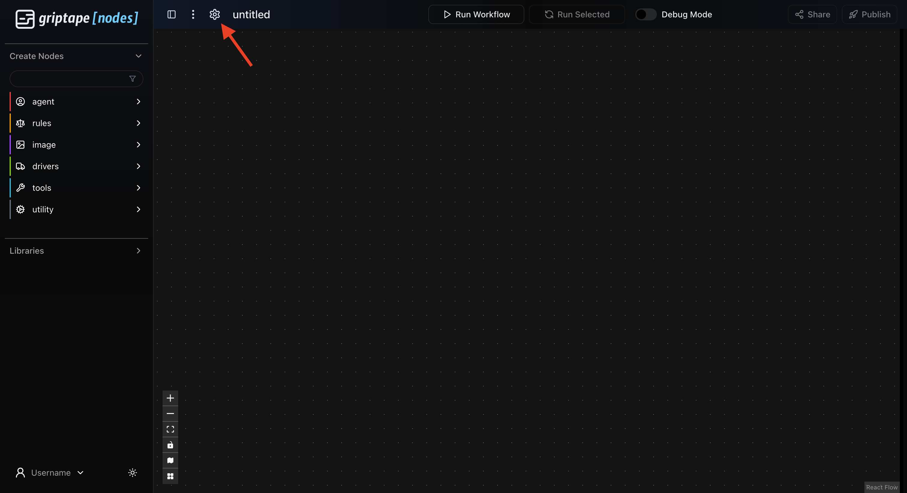
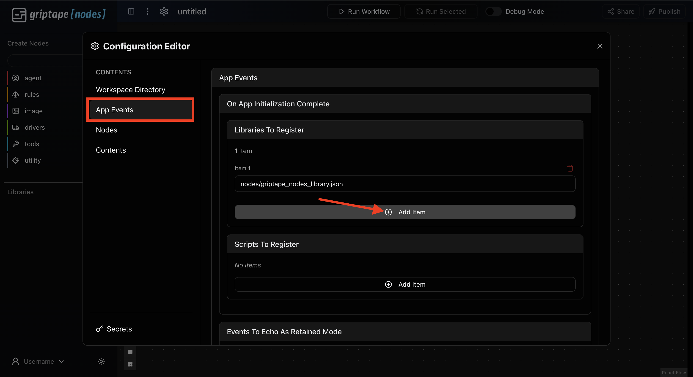
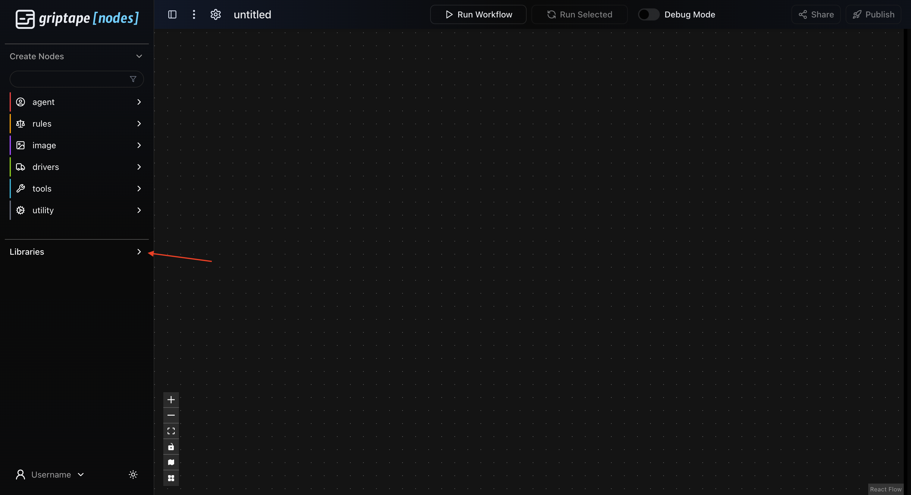
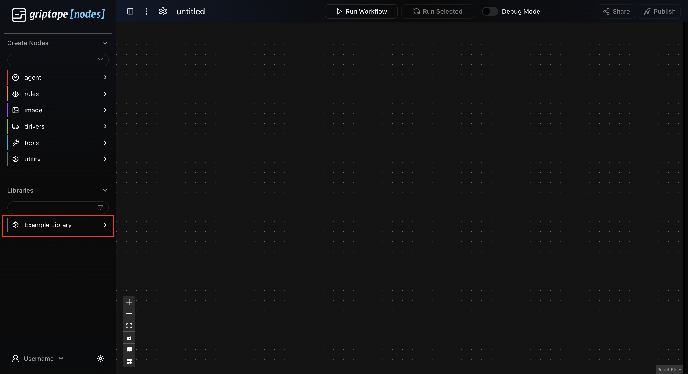
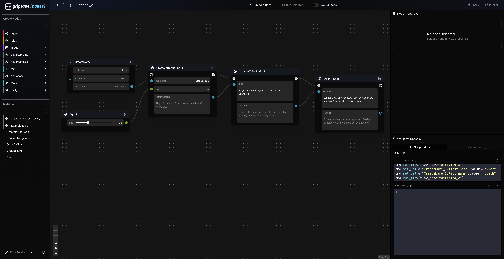

# Griptape Nodes: Node Library Template

Hi! Welcome to Griptape Nodes. 
This is a guide to write your own nodes and node library, in order to use in our [Griptape Nodes](https://www.griptapenodes.com/) platform. 

## Use this Template
Create your own repository using this GitHub Template. Use the Template button in the top right. 

Once you've created your own repository from this template, you need to pull it down to your local machine, or the machine where you are running your Griptape Nodes Engine. 

> **Hint**: It's recommended to clone this repository into your Griptape Nodes workspace directory. You can find your workspace directory by running:
> ```bash
> gtn config | grep workspace_directory
> ```
> Here's a quick way to navigate to your workspace directory:
> ```bash
> cd $(gtn config | grep workspace_directory | cut -d'"' -f4)
> ```
> Finally, clone the repository:
> ```bash
> git clone https://github.com/{{ .RepoName }}.git
> ```

## Rename Directory

To create your node library and make it importable by other users, please follow the steps below.

1. rename `example_nodes_template` to the name of your library.
2. Update the `pyproject.toml`:
    ```
    [project]
    name = "<your-library-name>"
    version = "0.1.0"
    description = "<your-description>"
    authors = [
        {name = "<Your-Name>",email = "<you@example.com>"}
    ]
    ```

Next, we'll create the nodes that will live in your library.

Each node is it's own python file, written in pure python code!

To create nodes for your library, please take a look at our provided examples in the `example_nodes_template` library and follow the steps below.

[Example Data Node](example_nodes_template/data_node.py)


[Example Control Node](example_nodes_template/control_node.py)


[Example Node with Dependencies](example_nodes_template/dependency_node.py)


## Define a file with your node name
Define a `<your-node-name>.py` file in your `<your-library-name>` directory. 

## Define the Node Class
There are two different types of Nodes that you could choose to define.

1. **ControlNode**
    Has Parameters that allow for configuring a control flow. They create the main path of the flow upon run. 
2. **DataNode**
    Solely has parameters that define and create data values. They can be dependencies of nodes on the main flow, but don't have control inputs/outputs.
    *You can add ControlParameters to a DataNode if desired to give it the functionality of a ControlNode.*

Within your `<your-node-name>.py`.
Add this import at the top of your file and define your Node or Nodes as a class. 

```
from griptape_nodes.exe_types.node_types import ControlNode, DataNode
from griptape_nodes.exe_types.core_types import Parameter

# Creating a Control Node
class <YourNodeName>(ControlNode):
    pass

# Creating a Data Node
class <YourNodeName>(DataNode):
    pass
```

## Initialize your Node and define your Parameters

Parameters are fields on the node that can be connected to other nodes or set by the user. 
Parameters have many fields that can be configured for their desired behavior. 
Only a couple of the fields are mandatory. The rest are optional.

### Parameter Fields 
1. name: `str` The name of the parameter. Must be unique to the node.
2. tooltip: `str | list[dict]` The description that will appear upon hovering the mouse.
3. type: `str` *OPTIONAL* The type of the value in the parameter. If not defined, it will be whatever the python type is.
4. input_types: `list[str]` *OPTIONAL* The allowed list of types that can be connected as an INPUT to your parameter.
5. output_type: `str` *OPTIONAL* The type that the OUTPUT of your parameter will be.
6. default_value: Any *OPTIONAL* A default value for your parameter if it isn't set
7. tooltip_as_input: `str | list[dict]` *OPTIONAL* Tooltip on the input port
8. tooltip_as_property: `str | list[dict]` *OPTIONAL* Tooltip on the property displapy
9. tooltip_as_output: `str | list[dict]` *OPTIONAL* Tooltip on the output port
10. allowed_modes: `set[ParameterMode]` 
    *OPTIONAL* The allowed modes. 
    `ParameterMode.INPUT`: Accepts inputs 
    `ParameterMode.OUTPUT`: Sends output
    `ParameterMode.PROPERTY`: Can be set on the node itself. 
11. ui_options: `dict`  *OPTIONAL* Informs the display of your node.
12. traits: `set[type[Trait] | Trait]` *OPTIONAL* Reusable classes that define features on a parameter, including converters and UI options. They are inheritable!
13. converters: `list[Callable[[Any], Any]]` *OPTIONAL* Modifies the parameter value after being set if needed.
14. validators: `list[Callable[[Parameter, Any], None]]` *OPTIONAL* Validates that the value on the parameter is correct.

## Define Node Method

Nodes have one absolute method that *absolutely* (haha) must be defined.
This is the method that is called by the node at runtime when a node executes. 
It completes the function of your node, whether thats creating a string, generating an image, or creating an agent.
```
def process(self) -> None:
    pass
```
### Additional Optional Methods
Nodes have additional methods that can provide functionality at or before runtime (and you can define as many helper functions as you'd like.)
1. Validate Node
``` 
def validate_node(self) -> list[Exception] | None:
        """Method called to check that all dependencies, like API keys or models, exist in the environment before running the workflow. 
        The default behavior is to return None. Custom Nodes that have dependencies will overwrite this method in order to return exceptions if the environment isn't set.
        For example, a node that uses an OpenAI API Key will check that it is set in the environment and that the key is valid. 

        Returns:
            A list of exceptions if any arise, or None. The user can define their own custom exceptions, or use provided python exceptions. 
        """
```
2. Before setting a value on a parameter
```
def before_value_set(self, parameter: Parameter, value: Any, modified_parameters_set: set[str]) -> Any:
    """Callback when a Parameter's value is ABOUT to be set.

        Custom nodes may elect to override the default behavior by implementing this function in their node code.

        This gives the node an opportunity to perform custom logic before a parameter is set. This may result in:
        * Further mutating the value that would be assigned to the Parameter
        * Mutating other Parameters or state within the Node

        If other Parameters are changed, the engine needs a list of which
        ones have changed to cascade unresolved state.

        Args:
            parameter: the Parameter on this node that is about to be changed
            value: the value intended to be set (this has already gone through any converters and validators on the Parameter)
            modified_parameters_set: A set of parameter names within this node that were modified as a result
                of this call. The Parameter this was called on does NOT need to be part of the return.

        Returns:
            The final value to set for the Parameter. This gives the Node logic one last opportunity to mutate the value
            before it is assigned.
        """
```
3. After setting a value on a parameter
```
def after_value_set(self, parameter: Parameter, value: Any, modified_parameters_set: set[str]) -> None: 
        """Callback AFTER a Parameter's value was set.

        Custom nodes may elect to override the default behavior by implementing this function in their node code.

        This gives the node an opportunity to perform custom logic after a parameter is set. This may result in
        changing other Parameters on the node. If other Parameters are changed, the engine needs a list of which
        ones have changed to cascade unresolved state.

        Args:
            parameter: the Parameter on this node that was just changed
            value: the value that was set (already converted, validated, and possibly mutated by the node code)
            modified_parameters_set: A set of parameter names within this node that were modified as a result
                of this call. The Parameter this was called on does NOT need to be part of the return.

        Returns:
            Nothing
        """
```
4. Checking if a connections to the node are allowed. 
The default value is true, but Custom nodes can implement this method however they'd like to control connections.
```
def allow_incoming_connection(
        self,
        source_node: Self,
        source_parameter: Parameter, 
        target_parameter: Parameter, 
    ) -> bool:
        """Callback to confirm allowing a Connection coming TO this Node.
        """
        return True
```
```
def allow_outgoing_connection(
        self,
        source_parameter: Parameter,  # noqa: ARG002
        target_node: Self,  # noqa: ARG002
        target_parameter: Parameter,  # noqa: ARG002
    ) -> bool:
        """Callback to confirm allowing a Connection going OUT of this Node."""
        return True
```
5. Callbacks AFTER creating or removing a connection
```
def after_incoming_connection(
        self,
        source_node: Self,  # noqa: ARG002
        source_parameter: Parameter,  # noqa: ARG002
        target_parameter: Parameter,  # noqa: ARG002
    ) -> None:
        """Callback after a Connection has been established TO this Node."""
        return
```
```
def after_outgoing_connection(
        self,
        source_parameter: Parameter,  # noqa: ARG002
        target_node: Self,  # noqa: ARG002
        target_parameter: Parameter,  # noqa: ARG002
    ) -> None:
        """Callback after a Connection has been established OUT of this Node."""
        return

```
```
def after_incoming_connection_removed(
        self,
        source_node: Self,  # noqa: ARG002
        source_parameter: Parameter,  # noqa: ARG002
        target_parameter: Parameter,  # noqa: ARG002
    ) -> None:
        """Callback after a Connection TO this Node was REMOVED."""
        return
```
```
def after_outgoing_connection_removed(
        self,
        source_parameter: Parameter,  # noqa: ARG002
        target_node: Self,  # noqa: ARG002
        target_parameter: Parameter,  # noqa: ARG002
    ) -> None:
        """Callback after a Connection OUT of this Node was REMOVED."""
        return
```


## Add Node to Library
In order to add a node to a library, you must configure your JSON file. This will keep track of all of the nodes in your library and allow them to be loaded on runtime!

## Create your library as a JSON file. This will be copied and imported into the engine at runtime.

```
{
    # Information about your library
    "name": "<Your-Library-Name>",
    "library_schema_version": "0.1.0",
    "metadata": {
        "author": "<Your-Name>",
        "description": "<Your Description>",
        "library_version": "0.1.0",
        "engine_version": "0.1.0",
        "tags": [
            "Griptape",
            "AI"
        ]
    },
    # Categories define different sections that you can organize your node into. These are UI hints that group how your nodes will be displayed within your library.
    "categories": [
        {
            # The ID of your category
            "Category1": {
                # These are all UI hints for the Editor
                "color": "border-red-500",
                "title": "Category1",
                "description": "<Your Description>",
                "icon": "Scale"
            }
        },
    ],
    # What nodes exist in this library?
    "nodes": [
        {   
            # The name of the class you defined in your <your-node-name>.py
            "class_name": "<YourNodeName>",
            # The relative file path to your node.
            "file_path": "<your-library-name>/<your-node-name>.py",
            "metadata": {
                # What category should this node be displayed in?
                "category": "Category1",
                "description": "<Your Description>",
                # The name you'd like displayed on Griptape Nodes.
                "display_name": "<Your Node Name>"
            }
        }
    ]
}
```

## Add your library to your installed Engine! 

If you haven't already installed your Griptape Nodes engine, follow the installation steps [HERE](https://github.com/griptape-ai/griptape-nodes).
After you've completed those and you have your engine up and running: 


1. Copy the path to your `library.json`. Right click on the file, and `Copy Path` (Not `Copy Relative Path`)

2. Start up the engine! 
3. Navigate to settings

4. Open your settings and go to the App Events tab. Add an item in **Libraries to Register**

5. Paste your copied `library.json` path from earlier into the new item 

6. Exit out of Settings. It will save automatically! 
7. Open up the **Libraries** dropdown on the left sidebar 

8. Your newly registered library should appear! Drag and drop nodes to use them!



### Here is an example flow that you could make with the provided nodes:

